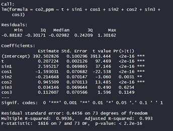

# Zaman Serileri Analizi 

## Hacettepe Üniversitesi Fen Fakültesi İstatistik Bölümü

### İsmail KILIÇ 

---

## İçindekiler

1. [Veri Setinin Tanıtımı](#veri-setinin-tanıtımı)
2. [Veriye Ait Grafikler](#veriye-ait-grafikler)
    - [Gecikme Grafiği](#gecikme-grafiği)
    - [ACF ve PACF Grafikleri](#acf-ve-pacf-grafikleri)
        - [Farka Ait ACF ve PACF Grafikleri](#farka-ait-acf-ve-pacf-grafikleri)
3. [Ayrıştırma Yöntemleri](#ayrıştırma-yöntemleri)
    - [Toplamsal Ayrıştırma](#toplamsal-ayrıştırma)
    - [Çarpımsal Ayrıştırma](#çarpımsal-ayrıştırma)
4. [Mevsimsel Zaman Serilerinde Regresyon Analizi](#mevsimsel-zaman-serilerinde-regresyon-analizi)
    - [Toplamsal Regresyon](#toplamsal-regresyon)
    - [Çarpımsal Regresyon](#çarpımsal-regresyon)
5. [Üstel Düzleştirme Yöntemi](#üstel-düzleştirme-yöntemi)
    - [Winters Üstel Düzleştirme Yöntemi](#winters-üstel-düzleştirme-yöntemi)
        - [Toplamsal Winters Üstel Düzleştirme Yöntemi](#toplamsal-winters-üstel-düzleştirme-yöntemi)
        - [Çarpımsal Winters Üstel Düzleştirme Yöntemi](#çarpımsal-winters-üstel-düzleştirme-yöntemi)
6. [Box-Jenkins Modeli ile Tahmin ve Öngörü](#box-jenkins-modeli-ile-tahmin-ve-öngörü)
    - [Model Seçimi ve İncelemesi](#model-seçimi-ve-incelenmesi)
    - [Modelin Tahmini](#modelin-tahmini)
    - [Modelin Öngörüsü](#modelin-öngörüsü)
7. [Kaynakça](#kaynakça)

---

## Veri Setinin Tanıtımı

1.01.2012 - 1.09.2018 tarihleri arasında havadaki karbondioksit oranına ait veriler incelenip tahmin modeli geliştirilmiştir.

| Tarih      | CO2 PPM |
|------------|---------|
| 1.01.2012  | 39312   |
| 1.02.2012  | 39386   |
| 1.03.2012  | 3944    |
| 1.04.2012  | 39618   |
| ...        | ...     |
| 1.05.2018  | 41124   |
| 1.06.2018  | 41079   |
| 1.07.2018  | 40871   |
| 1.08.2018  | 40699   |
| 1.09.2018  | 40551   |

## Veriye Ait Grafikler

Grafik incelendiğinde mevsimsellik ve yukarı yönlü trend gözlemlenmektedir.

### Gecikme Grafiği

### ACF ve PACF Grafikleri

ACF grafiği incelendiğinde ilk dört veri güven sınırları dışarısında olup seride trend olduğunu desteklemektedir. Yine ACF grafiğine bakıldığında baskın mevsimsellik gözlemlenmiştir.

### 1.Farka Ait ACF ve PACF Grafikleri

### 2.Farka Ait ACF ve PACF Grafikleri

Seride trend ve baskın mevsimsellik kalmamış, durağanlaştırılmıştır.

## Ayrıştırma Yöntemleri

### Toplamsal Ayrıştırma

Veriler ile tahmin serisi uyumlu gözükmektedir. Ancak Box-Ljung testi ve ACF grafiği incelendiğinde hata serisi akgürültü serisi olmadığı için Toplamsal Ayrıştırma Yöntemi’nin uygun olmadığı görülmektedir.

### Çarpımsal Ayrıştırma

Veriler ile tahmin serisi uyumlu gözükmektedir. Ancak Box-Ljung testi ve ACF grafiği incelendiğinde hata serisi akgürültü serisi olmadığı için Çarpımsal Ayrıştırma Yöntemi’nin de uygun olmadığı görülmektedir.

## Mevsimsel Zaman Serilerinde Regresyon Analizi

### Toplamsal Regresyon

Regresyon katsayılarının tamamı anlamlı olduğu için 2. harmonik işlem uygulanır.

#### 2. Harmonik İşlem Modeli

2. harmonik işlem modelinde regresyon katsayıları anlamlı çıkmaya devam etmiştir. 3. Harmonik işlem modeli uygulanır.

#### 3. Harmonik İşlem Modeli

3. harmonik işlem modelinde “sin3” ve “cos3” regresyon katsayısı anlamsız çıkmıştır. Bütün regresyon katsayıları anlamlı olmadığı için 2. modele geri dönülür. 2. Harmonik işlem modeli uygulanır.

Durbin-Watson testi incelendiğinde istatistiği 0.83048 olarak hesaplanmış olup pozitif otokorelasyon olduğunu söyleyebiliriz. P değeri 0.05’ten küçük olduğu için yokluk hipotezi (H0<0.05) reddedilir modelin anlamlı olduğu söylenebilir.

Orijinal seri ile tahmin serisinin güven aralığında yer alması grafikte verilmiş olup alt ve üst sınırları ile aynı değerleri aldığı gözlemlenmektedir.

Box-Ljung testi incelendiğinde P değeri 0.05’ten küçük olduğu için yokluk hipotezi (HS<0.05) reddedilir, hata terimleri arasında anlamlı bir otokorelasyon bulunmaktadır. ACF grafiği incelendiğinde de hataların akgürültü olmadığı gözlemlenmiştir. Toplamsal Regresyon Modeli’nin anlamlı olmadığı söylenebilir.

### Çarpımsal Regresyon

Regresyon katsayılarının tamamı anlamlı olduğu için 2. harmonik işlem uygulanır.

#### 2. Harmonik İşlem Modeli

2. harmonik işlem modelinde “sinx2” regresyon katsayısı anlamsız çıkmıştır. Bütün regresyon katsayıları anlamlı olmadığı için 1. modele geri dönülür. 1. Harmonik işlem modeli uygulanır.

Durbin-Watson testi incelendiğinde istatistiği 0.51901 olarak hesaplanmış olup pozitif otokorelasyon belirtisi olduğunu söyleyebiliriz. P değeri 0.05’ten küçük olduğu için yokluk hipotezi (HS<0.05) reddedilir modelin anlamlı olduğu söylenebilir.

Orijinal seri ile tahmin serisinin güven aralığında yer alması grafikte verilmiş olup alt ve üst sınırlar ile uyumlu olmadığı gözlemlenmektedir.

Box-Ljung testi incelendiğinde P değeri 0.05’ten küçük olduğu için yokluk hipotezi (HS<0.05) reddedilir, hata terimleri arasında anlamlı bir otokorelasyon bulunmaktadır. ACF grafiği 
incelendiğinde de hataların akgürültü olmadığı gözlemlenmiştir. Çarpımsal Regresyon Modeli’nin anlamlı olmadığı söylenebilir.

## Üstel Düzleştirme Yöntemi

### Winters Üstel Düzleştirme Yöntemi

#### Toplamsal Winters Üstel Düzleştirme Yöntemi

Winters üstel düzleştirme yöntemine göre ortalama düzeyin başlangıç değeri 392.9168; eğimin başlangıç değeri 0.2023; mevsimsel terimin başlangıç değerleri sırasıyla:

- M1(0) = -0.673
- M2(0) = -1.9801
- M3(0) = -3.4701
- M4(0) = -3.654
- M5(0) = -1.8863
- M6(0) = 0.4189
- M7(0) = 2.3747
- M8(0) = 3.5112
- M9(0) = 2.9576
- M10(0) = 1.5358
- M11(0) = 0.7112
- M12(0) = 0.1545

Bu başlangıç değerleri kullanılarak optimal düzleştirme katsayıları α = 0.4623; β = 1e-04; γ ≅ 1e-04 olarak elde edilmiştir. Toplamsal Winters Yöntemi için HKO değerinin karekökü 0.3189255 BIC değeri 245.5314 olarak bulunmuştur.

#### Çarpımsal Winters Üstel Düzleştirme Yöntemi 

Winters üstel düzleştirme yöntemine göre ortalama düzeyin başlangıç değeri 392.4746; eğimin başlangıç değeri 0.2579; mevsimsel terimin başlangıç değerleri sırasıyla:

- M1(0) = 0.9983
- M2(0) = 0.9951
- M3(0) = 0.9915
- M4(0) = 0.991
- M5(0) = 0.9952
- M6(0) = 1.0009
- M7(0) = 1.0058
- M8(0) = 1.0085
- M9(0) = 1.0073
- M10(0) = 1.0038
- M11(0) = 1.0019
- M12(0) = 1.0007

Bu başlangıç değerleri kullanılarak, optimal düzleştirme katsayıları α = 0.5478; β = 0.0613; γ ≅ 1e-04 olarak elde edilmiştir. Toplamsal Winters Yöntemi için HKO değerinin karekökü 0.3295758, BIC değeri 253.2672 olarak bulunmuştur.

#### Toplamsal Winters Üstel Düzleştirme Yöntemi ile Tahmin ve Öngörü 
Toplamsal ve Çarpımsal yöntemlerin her ikisi de karşılaştırıldığında; BIC değerleri Toplamsal için 245.5314, Çarpımsal için 256.2672 olarak bulumuştur. HKO değerleri Toplamsal için 
0.3189255, Çarpımsal için 0.3295758 olarak bulunmuştur. Her iki değer bakımından karşılaştırıldığında Toplamsal Düzleştirme yöntemi daha küçük olduğu için öngörü yapmak üzere seçilir.

Orijinal seri ile tahmin serisinin uyum gösterdiği grafik üzerinden görülmektedir.

Box-Ljung testi incelendiğinde P değeri 0.05’ten büyük olduğu için yokluk hipotezi (H_S<0.05) reddedilmez, hata terimleri arasında anlamlı bir otokorelasyon bulunmamaktadır. ACF grafiği incelendiğinde de hataların akgürültü olduğu gözlemlenmiştir. Toplamsal Üstel Düzleştirme Yöntemi’nin anlamlı olduğu ve modelin öngörü için kullanılabileceği söylenmektedir.

#### Öngörü

Toplamsal Model ile elde edilen öngörüde Ekim ayından itibaren ilk 5 aylık öngörüyü sırasıyla 405.7594, 407.4517, 408.9605, 409.9908, 410.7497 olarak tahmin etmiştir.

## Box – Jenkins Modeli ile Tahmin ve Öngörü
### Model Seçimi ve İncelemesi

Serinin birinci ve birinci mevsimsel farklarının alınmasından sonra elde edilen ACF grafiği incelendiğinde, serinin durağanlaşmış olduğu görülmektedir. Serinin durağanlaşması bize modelleme yapılabileceğini göstermektedir. ACF ve PACF grafikleri birlikte değerlendirildiğinde PACF grafiğinin daha hızlı azaldığı görülmektedir. Model olarak, otoregresyon model kullanılacaktır. 
	Bu nedenle q = 0, serinin birinci farkı ve mevsimsel farkı alındığı için d = 1 ve D = 1, ilk gecikmeye ait ilişki önemli olduğu için p = 1 ve periyodun yanındaki gecikmeler aynı yönlü olmadığı için P = 0 olmaktadır. Q için yapılan en iyi denemeler sonucunda en küçük BIC değerine sahip model aracılığı ile 0 olarak bulunmuştur.

Seriye uygun model ARIMA(1,1,0)(0,1,1)_12 olmaktadır.

	Modele ilişkin sonuçlar incelendiğinde: 

Ar1 katsayısı-0.4340 ve standart hatası 0.1079; Sma1 katsayısı -0.9997 ve standart hatası 0.2166 olarak bulunmuştur. Önceki zaman noktasındaki değerlerle negatif bir ilişki olduğunu göstermektedir.

Ar1 katsayısı -0.43401, Sma1 katsayısı -0.99971 olarak bulunmuştur. Sıfırdan farklı ve istatistiksel olarak anlamlı olduklarını, veri setine uygun olup modelin başarısında etkili olduğunu söyleyebiliriz.

### Modelin Tahmini

Orijinal seri ile tahmin serisi uyum göstermektedir.

H_0: Seride Otokorelasyon yoktur.
H_S: Seride Otokorelasyon vardır.
P değeri 0.859 olup H_0 kabul edilir. Serideki otokorelasyonun istatistiksel olarak anlamlı olmadığını gösterir. Modelin hata terimleri arasında istatistiksel olarak anlamlı bir otokorelasyon bulunmamaktadır. Model hata terimlerinden bağımsızdır ve öngörü yaparken geçmiş hatalara bağımlı bir desen içermediğini göstermektedir.

ACF grafiği incelendiğinde de hataların akgürültü olduğu gözlemlenmiştir. Modelin anlamlı olduğu ve öngörü için kullanılabileceği söylenmektedir.

### Modelin Öngörüsü 

Model ile elde edilen öngörüde Ekim ayından itibaren ilk 5 aylık öngörüyü sırasıyla 405.8883, 407.5502, 409.0434, 410.1841, 410.8497 olarak tahmin etmiştir.

### Modele Ait Öngörü Grafiği

# Kaynakça
Data Camp. DataCamp: https://app.datacamp.com/learn/courses/arima-models-in-python 

Prof.Dr.Cem Kadılar, D. Ö. (2020). SPSS ve R Uygulamalı Zaman Serileri Analizine Giriş. Ankara: Seçkin Yayıncılık.

